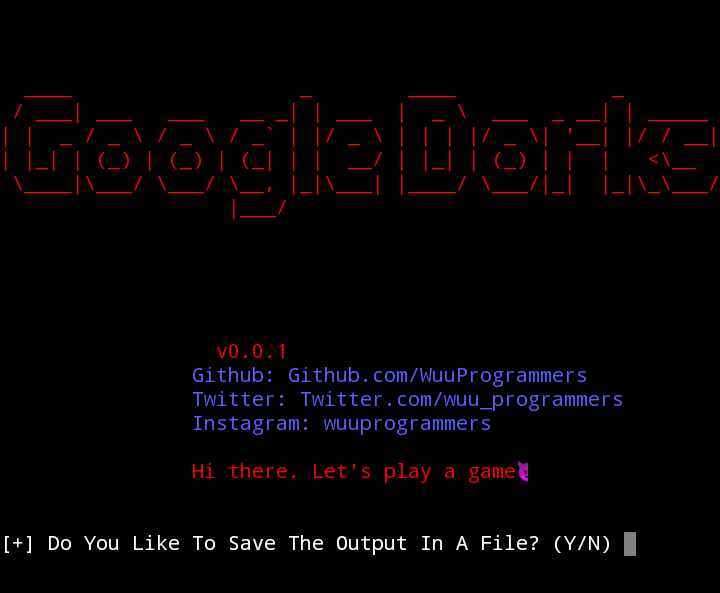

## GoogleDorks

GoogleDorks gathers websites and applications that may be vulnerable to attack, as well as other useful information that has been discovered by Google's search bots.

You have the option to store the results in a file for future reference. You are in control of how many searches you wish to conduct and how many websites you would like to see in the output.

GoogleDorks can be employed as a Command Line Interface (CLI) to quickly look up information on Google. Unlike the regular search engine, it only displays the relevant links, without any advertisements, and it can do so efficiently.

Take care not to exceed the limit when performing requests. If you do, there's a chance Google will throw up captchas, which is very inconvenient and will limit your ability to search quickly and efficiently.

## Data you can find using GoogleDorks
1. Username and passwords
2. Admin login pages
3. Sensitive documents
4. Govt/military data
5. Email lists
6. Bank account details
7. Vulnerable websites

and other cool stuff too.
***
## Install GoogleDorks
GoogleDorks can be installed & used in:
* Kali Linux
* Parrot 
* BlackArch
* Termux

****
# [√] Installation and Usage on Linux
* $ sudo git clone https://github.com/WuuProgrammers/GoogleDorks
* $ cd GoogleDorks
* $ pip3 install -r requirements.txt
* $ sudo python3 GoogleDorks.py
****
# [√] Installation and Usage on Termux
* $ git clone https://github.com/WuuProgrammers/GoogleDorks
* $ cd GoogleDorks
* $ pip install -r requirements.txt
* $ python GoogleDorks.py
****
## DISCLAIMER:
### 1. This tool was created to be used for educational purposes and penetration testing only!
### 2. The author does not accept any liability for any harm or damage caused by this tool.
### 3. Do not utilize the data obtained from this tool to gain access without permission.
### 4. It is illegal to engage in any hacking activity without written authorization.
***

## Want to have a little chat? Find me on:

<a href="https://www.instagram.com/wuuprogrammers/" target="_blank">

### Stargazers
